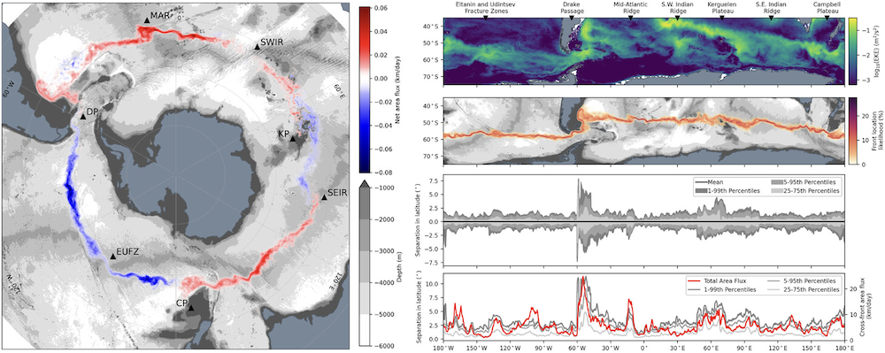

# Projects

## In development
In my personal time I've been diving into Dutch energy and power market data to learn more about the intricacies of the EU energy market. Apart from my exploratory data analysis, I'm currently working on two tools in this space.

### CloudPredict
Solar generation forecasting errors are the dominant source of intraday volatility in Dutch power markets in summer. I'm currently developing an automated Python-based forecasting tool that uses satellite imagery and high-resolution wind model data to forecast near-future cloud coverage over solar farms. The simple idea is to quantify the impact of clouds passing over large solar farms and predict the impact on power prices.

This project is a direct application of my PhD research skills! In its early stages, you can follow the project on [GitHub here](https://github.com/michaeldenes/CloudPredict).

### BalancePredict
In the Dutch energy markets bidding zone, TenneT publishes the balance delta every minute. When the system is short, the imbalance price spikes upward; when long, it drops. As a balance responsible party (BRP), you can earn significant revenue by being on the right side of this signal in advance. I'm currently developing an automated Python-based analysis and forecasting tool that uses TenneT imbalance delta data and ENTSO-E power generation data to predict the near-future power imbalances in the Dutch power markets.

This project is in its early stages; you can follow the project on [GitHub here](https://github.com/michaeldenes/BalancePredict).

## Academic Software Packages
I've contributed to a few different software packages during my PhD and postdoc positions. Below are two packages I lead the development for.

### PlasticParcels
`plasticparcels` is a python package I've developed for simulating the transport and dispersion of plastics in the ocean. This tool simplifies the process of simulating plastic dispersion in the ocean. You can find more information on the [project website](https://plastic.parcels-code.org/en/latest/index.html) or on [GitHub](https://github.com/Parcels-code/plasticparcels). A manuscript detailing the first release of `plasticparcels`, v0.3.1, has been published in the [Journal of Open Source Software (JOSS)](https://doi.org/10.21105/joss.07094).

Output from a simulation of the dispersion of surface microplastic concentrations in the Arctic Ocean from 2008 through 2022 is shown below. The vast majority of the microplastic pollution that enters the Arctic comes from the Atlantic, and the Transpolar Drift tends to act as a transport barrier against plastic entering the Beaufort gyre. This simulation was developed as part of the [NECCTON](https://neccton.eu/) project, you can interact with the dataset below.

<iframe src="https://data.neccton.eu/-/d48inw6yjg" width="100%" height="450px"></iframe>

### FEMDLpy
As part of my Ph.D., I converted the MATLAB package `FEMDL` (Finite-Element Method Dynamic Laplacian) into a python package [`FEMDLpy`](https://github.com/michaeldenes/FEMDLpy). This package can be used to identify *Lagrangian Coherent Structures* (the skeletons of chaos) in turbulent, chaotic flows based on a Finite-Element Method approach. Using Lagrangian particle trajectory data, this tool can identify regions of a fluid flow that remain *coherent*, that is, they minimally mix with other regions of fluid.

I've used this package for [identifying and tracking quasi-coherent ocean eddies](https://doi.org/10.1103/PhysRevFluids.7.034501) (enormous rotating vortices in the ocean) in order to study their coherence properties, as well as [identifying and tracking circumpolar Southern Ocean fronts](https://doi.org/10.1175/JPO-D-24-0038.1) (sharp boundaries between water masses with different properties) which revealed an as-yet undiscovered global pattern of ocean transport! To use the Southern Ocean research as an example, in the video below three circumpolar fronts are identified and tracked using `FEMDLpy`.

<iframe width="360" height="370" src="https://www.youtube.com/embed/e0GW1gd1DgY?si=gkGvXoDmsV3ve30-" title="YouTube video player" frameborder="0" allow="accelerometer; autoplay; clipboard-write; encrypted-media; gyroscope; picture-in-picture; web-share" referrerpolicy="strict-origin-when-cross-origin" allowfullscreen></iframe>

By carefully tracking water parcels that cross these fronts, we identified a distinctive pattern of cross-front transport. We can relate the locations of strong cross-front transport to regions of strong frontal meandering (caused by the Antarctic Circumpolar Current changing direction to by-pass prominent bathymetric obstacles like islands and sea mounts to conserve potential vorticity) and high Eddy Kinetic Energy (EKE).

